# CMIT 495 - Project 1: AWS Virtualization Proof-of-Concept

**Student:** Aron Michaels   
**Date:** March 17, 2026  
**Course:** CMIT 495 Current Trends and Projects in Computer Networks and Security

## Project Overview
I launched a secure Ubuntu 24.04 server in AWS EC2, connected remotely using PuTTY SSH, applied OS updates, ran host and network commands, and properly terminated the instance. This project demonstrates cloud virtualization, secure remote access, and basic cybersecurity practices.

## Skills Demonstrated
- Cloud VM provisioning (Amazon EC2)  
- Secure SSH key-based authentication  
- Linux package management (`apt-get update` and `upgrade`)  
- Network configuration and security groups  
- Documentation of every step with screenshots  
- Understanding of virtualization benefits, challenges, and security posture (NIST SP 800-125 & course Learning Resource)

## Files
- [Project1-Final.pdf](Project1-Final.pdf) ← Full assignment with all screenshots and explanations  
- `/screenshots` folder containing every step (launch wizard, SSH, updates, commands, termination)

## Screenshots Gallery
Click any image below to enlarge — all steps are shown right here on the page:

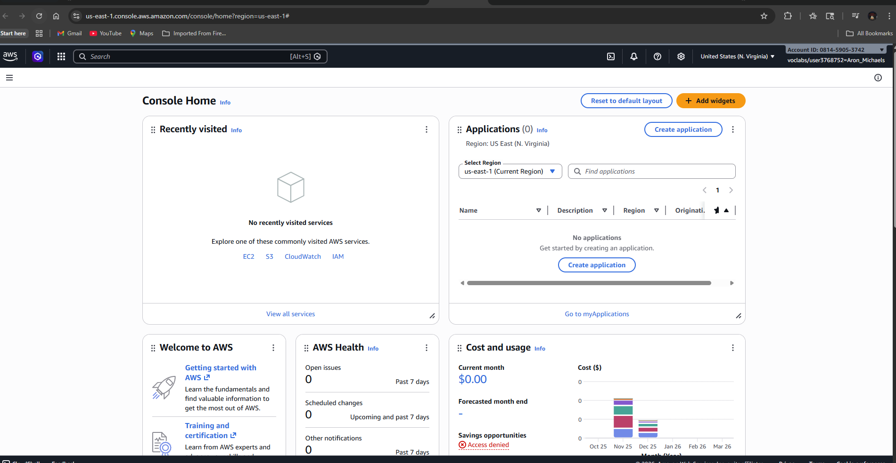  
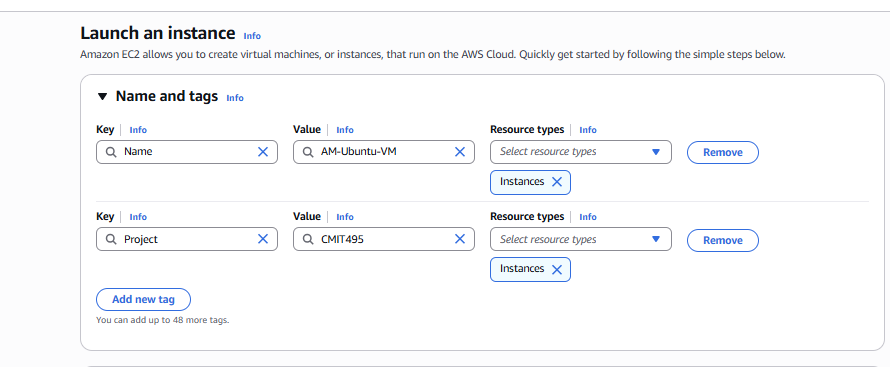  
  
  
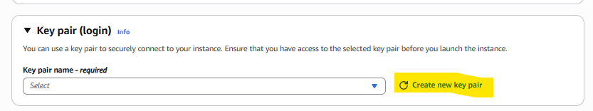  
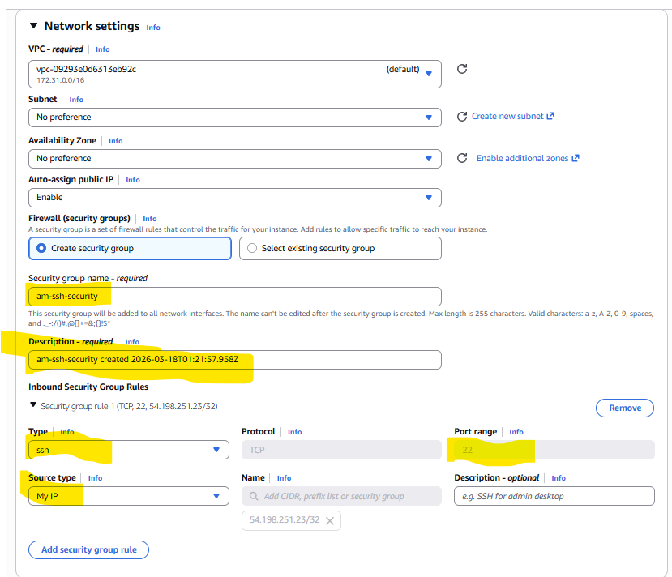  
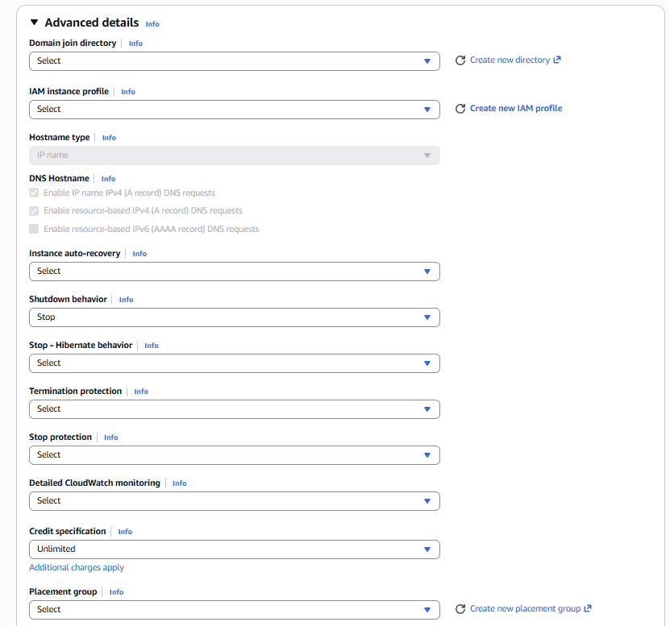  
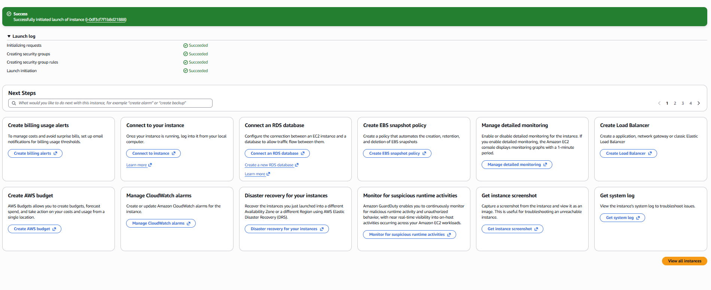  
  
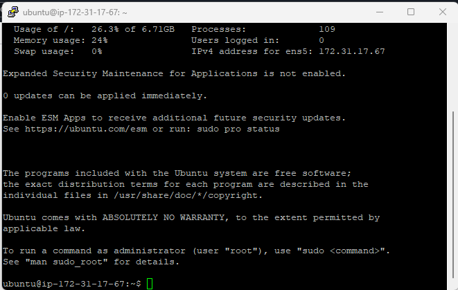  
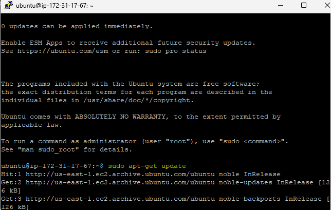  
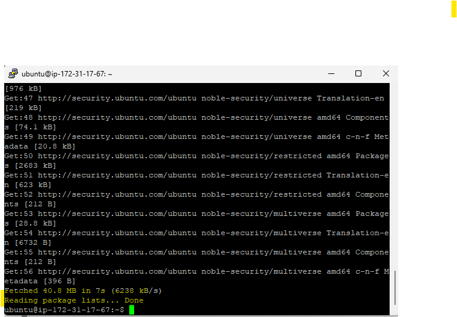  
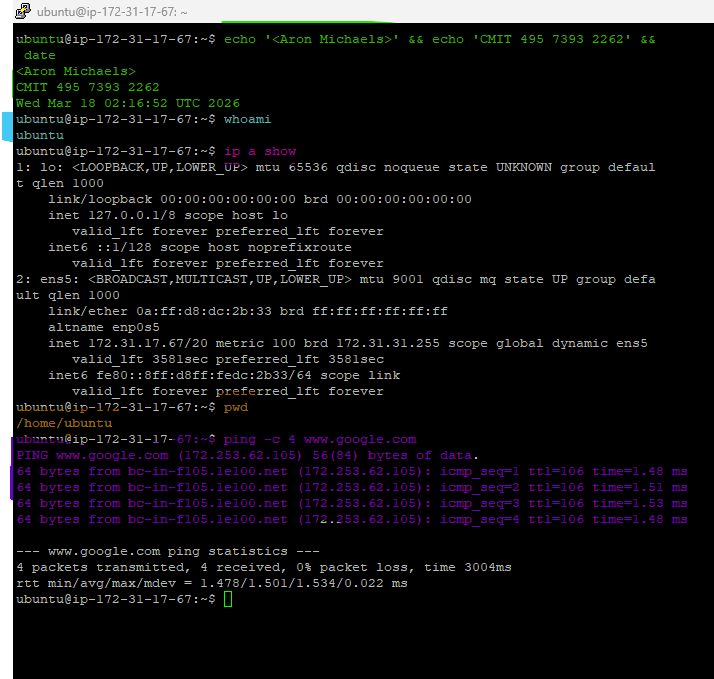  
  
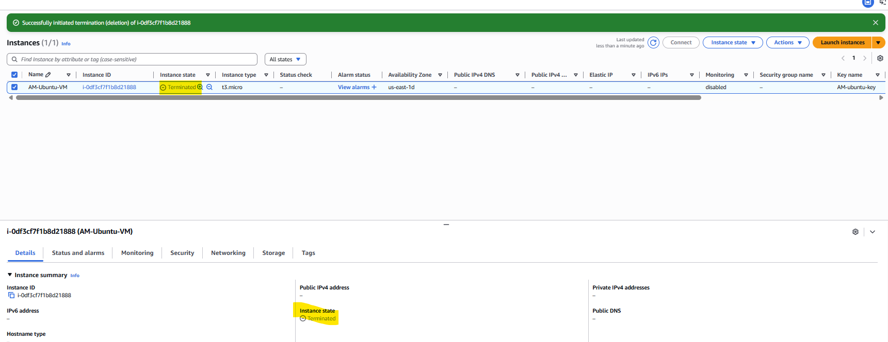

## Key Learning Outcomes
- Virtualization enables isolation, scalability, and portability in the cloud.  
- Proper security group configuration and key-based SSH are essential for protecting remote servers.  
- Always terminate resources to stay within lab budget and follow best practices.

This project was completed as part of the UMGC CMIT 495 program and directly supports my goal of transitioning from call center work into entry-level cybersecurity/IT roles.

⭐ Open to feedback or collaboration!
